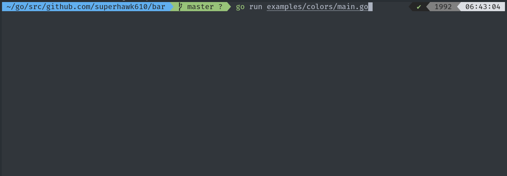

# bar

This package is a port of the [progress](https://github.com/visionmedia/node-progress) package, written in Golang.



## Installation

```
go get github.com/superhawk610/bar github.com/superhawk610/terminal
```

## Getting Started

```go
package main

import (
	"time"

	"github.com/superhawk610/bar"
)

func main() {
	n := 20
	b := bar.New(30)

	for i := 0; i < n; i++ {
		b.Tick()
		time.Sleep(500 * time.Millisecond)
	}

	b.Done()
}
```

There are additional examples of more advanced usage in the [examples](examples) directory.

## Colored Output

This package works well with color libraries like [ttacon/chalk](https://github.com/ttacon/chalk). In order to get the output displayed in the GIF above, you'd use it like so:

```go
package main

import (
	"time"

  "github.com/superhawk610/bar"
  "github.com/ttacon/chalk"
)

func main() {
	n := 20
	b := bar.New(
    bar.WithDimensions(20, 20),
    bar.WithFormat(
      fmt.Sprintf(
        " %sloading...%s :percent :bar %s:rate ops/s%s ",
        chalk.Blue,
        chalk.Reset,
        chalk.Green,
        chalk.Reset,
      )
    )
  )

	for i := 0; i < n; i++ {
		b.Tick()
		time.Sleep(500 * time.Millisecond)
	}

	b.Done()
}
```

## Configuration

This package uses the [functional options pattern](https://halls-of-valhalla.org/beta/articles/functional-options-pattern-in-go,54/) to support incremental configuration. To create a new instance of `bar` with options, use the `bar.NewWithOpts` function and provide any number of configuration augments (listed below).

### `WithCallback(cb func())`

Provide a callback function to be executed when the bar is completed via `b.Done()`.

### `WithDisplay(start, complete, head, incomplete, end string)`

Provide display characters to be used when outputting the bar to the terminal.

```
[ xxx >    ]
| |   | |  |- end
| |   | |- incomplete
| |   |- head
| |- complete
|- start
```

### `WithDimensions(total, width int)`

Provide dimensions for the total value of the progress bar and its output width.

### `WithOutput(out Output)`

Provide an output stream for displaying the progress bar. `Output` is essentially an `io.Writer`, but it also exposes a `ClearLine()` function to clear the current line of output and return the cursor to the first index. By default, this uses `os.Stdout`.

### `WithContext(ctx Context)`

Provide an initial value for the bar's context (read more about how to use context with custom verbs below).

### `WithFormat(f string)`

Provide an ordering of verbs to be used when outputting the progress bar. You can choose from the standard included verbs `:bar`, `:progress`, and `:rate`, or you can provide your own verbs using the `Ctx` helper (verbs must always be prefixed with `:`):

#### Standard Verbs

The following verbs are included:

##### `:bar`

Output the progress bar visual.

```
[------>           ]
```

##### `:percent`

Output the total progress percentage.

```
38.4%
```

##### `:rate`

Output the total progress rate (in completed ticks per second).

```
2.1 ops/s
```

**NOTE:** This verb does not display a unit by default, so you'll need to provide your own units (eg - `ops/s`).

#### Custom Verbs

You can provide your own verbs when defining a format. Custom verbs must be prefixed with a colon `:`. You may not use any of the standard verbs as custom verbs.

First, include the verb when defining your format:

```go
b := bar.NewWithOpts(
	bar.WithDimensions(n, 30),
	bar.WithFormat(" :bar :hello :world "),
)
```

You'll also probably want to include a default value for each custom verb using the `WithContext` helper mentioned above.

Then, whenever ticking or updating your progress bar, provide a `Context` slice with the value(s) you'd like to have displayed in their place. Use the `Ctx` helper to clean up the syntax:

```go
b.TickAndUpdate(bar.Context{
	bar.Ctx("hello", "Hello,"),
	bar.Ctx("world", "world!"),
})
```

This will produce the following output:

```
[----->            ] Hello, world!

```

### `WithDebug()`

Debugging crowded layouts can be difficult, so this helper swaps each bar component's `print()` method for its `debug()` method, displaying its internal state and type.

```
 <barToken p={4} t={10}> <percentToken "40.0%"> <customVerbToken verb="hello" value="Hello!">
```

## License

Copyright &copy; 2019 Aaron Ross, all rights reserved. View the ISC license [here](LICENSE).
